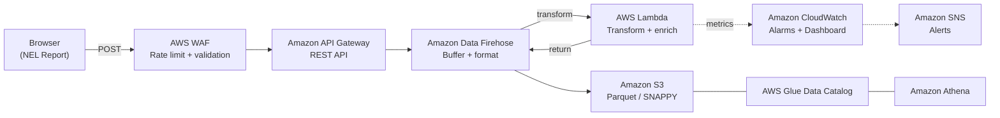

# NEL Reporting Pipeline

DNS resolution failures, TCP connection resets, and TLS handshake timeouts happen before a request reaches your servers, so your server-side logs never record them. The [W3C Network Error Logging](https://w3c.github.io/network-error-logging/) (NEL) specification lets supporting browsers report these errors to an endpoint you control. This project deploys a serverless pipeline on AWS that collects, stores, and analyzes those reports with a single `cdk deploy`.

## What NEL gives you

- Visibility into failures your servers never see. DNS, connection, and TLS errors occur before a request reaches your infrastructure.
- Real user data. Every report comes from an actual browser session on a real network path, not synthetic monitoring.
- No client-side code. Browsers send reports automatically through HTTP headers, with no JavaScript SDK.
- Error rates broken down by type, phase, URL, and server IP across real user sessions.

> **Important:** This is sample code for demonstration and educational purposes only. It is not intended for production use without additional security review and testing. You should work with your security and legal teams to meet your organizational requirements before deployment. Deploying this solution may incur AWS charges.

## Architecture



| Layer | Service | Details |
|-------|---------|---------|
| Protection | AWS WAF | Positive security model: rate limit, AWS managed rules, path + method + body validation |
| Ingestion | API Gateway | Regional REST API, `application/reports+json` only |
| Buffering | Firehose | 64 MB / 300s buffer, JSON-to-Parquet format conversion (SNAPPY) |
| Transform | Lambda | Expand browser arrays to NDJSON, enrich records, and publish bounded metrics |
| Storage | S3 | 14-day lifecycle, SSE-S3 encryption, Parquet columnar format |
| Analytics | Athena | Partition projection (year/month/day), no AWS Glue crawler needed |
| Alerting | CloudWatch + SNS | API errors, Lambda failures, Firehose issues, data freshness |

## Prerequisites

Before you begin, you need:

- Node.js 22.x or later
- AWS CDK CLI (`npm install -g aws-cdk`)
- AWS CLI configured with credentials (`aws configure`)
- An AWS account with permissions to create AWS CloudFormation stacks, Lambda functions, S3 buckets, API Gateway APIs, and related resources

## Quick Start

```bash
npm install
npm run build
cdk bootstrap aws://ACCOUNT-ID/REGION   # first time only
cdk deploy
```

The stack deploys to your configured AWS region (`CDK_DEFAULT_REGION` or AWS CLI profile).

Outputs after deploy:
- `APIEndpoint`: NEL reporting URL, including the `/prod/` stage path
- `BucketName`: S3 bucket for reports
- `AthenaResultsBucketName`: S3 bucket for Athena query results
- `FirehoseStreamName`: Firehose delivery stream
- `AlarmTopicArn`: SNS topic for alarm notifications

Verify the deployment succeeded by confirming these outputs are displayed. AWS CDK can also display a construct-generated API endpoint output. If the deployment fails, check the AWS CloudFormation console for error details.

Then [configure NEL headers](docs/nel-headers.md) on your web application or Amazon CloudFront distribution.

## Sending a Test Report

```bash
curl -X POST https://YOUR-API-ID.execute-api.YOUR-REGION.amazonaws.com/prod/ \
  -H "Content-Type: application/reports+json" \
  -d '[{"type":"network-error","url":"https://example.com","body":{"type":"dns.name_not_resolved","phase":"dns","elapsed_time":5000,"sampling_fraction":1.0}}]'
```

## Querying Reports

```sql
SELECT body.type, COUNT(*) as cnt
FROM nel_analytics.nel_reports
WHERE year='2026' AND month='05' AND day='17'
GROUP BY body.type ORDER BY cnt DESC;
```

See [`docs/athena-queries.md`](docs/athena-queries.md) for more query patterns.

## Project Structure

```
bin/nel-project.ts           CDK app entry point (cdk-nag enabled)
lib/nel-project-stack.ts     CDK stack, all infrastructure
lambda/index.js              Firehose transform: decode, expand arrays, enrich
test/nel-project.test.ts     CDK assertion tests (built-in node:test runner)
test/lambda-transform.test.js  Lambda transform tests (built-in node:test runner)
scripts/                     Deploy, cleanup, test, and load generation scripts
docs/                        Configuration, NEL headers, queries, monitoring
```

## Testing

```bash
npm test                                                        # CDK assertions + Lambda transform tests
./scripts/test-nel-errors.sh https://YOUR-ENDPOINT/prod/ --all  # 29 error types + ok (30 outcomes)
./scripts/test-athena-queries.sh                                # 17 Athena queries
./scripts/generate-nel-data.sh https://YOUR-ENDPOINT/prod/ 5 10 # synthetic load
```

## Security

- AWS WAF positive security model: default BLOCK, label-based allow
- Rate controls: AWS WAF 1,000 requests per 5 minutes per IP; API Gateway 100 RPS/200 burst across the stage
- Managed protections: AWS IP Reputation, Core Rule Set, and Known Bad Inputs
- Content-Type enforcement: only `application/reports+json` accepted
- S3: BlockPublicAccess, enforceSSL, SSE-S3 encryption
- AWS Identity and Access Management (IAM): least-privilege, namespace-scoped permissions
- No authentication by design. Browsers send NEL reports anonymously per the W3C specification
- Lambda structured logging and blocked-only WAF logging are independent opt-in features and default to off
- W3C extension error types are stored as received but aggregate into the bounded CloudWatch metric value `other`

## Operational limits and data handling

The API Gateway setting is an aggregate token-bucket target for the stage; the WAF setting is a separate rolling per-IP control. Throttling is best effort and clients can receive `429` from API Gateway or `403` from WAF. AWS WAF can inspect up to 16 KB of an API Gateway request body by default, but the deployed AWS Managed Rules Core Rule Set blocks bodies larger than 8 KB. The effective default request-body ceiling is therefore 8 KB. Bodies beyond the integration inspection limit also cannot receive the positive-validation label. Managed rules can block smaller payloads that resemble attacks; test representative browser batches before broader use.

NEL reports may contain URLs, query strings, referrers, user agents, public server IPs, and timings. Review data classification, privacy/legal requirements, access controls, retention, and current AWS pricing before deployment. The reports bucket expires objects after 14 days. Detailed Lambda and WAF logs remain off unless explicitly enabled in `cdk.json`.

Firehose performs JSON-to-Parquet conversion, but its JSON deserializer does not accept browser report arrays. The transform Lambda expands those arrays into newline-delimited JSON before conversion and adds metadata. See [Architecture decisions](docs/architecture-decisions.md) for the documented trade-offs.

## Cleanup

```bash
./scripts/cleanup.sh                    # remove the stack, Data Catalog, and log groups (S3 bucket retained)
./scripts/cleanup.sh --delete-bucket    # also delete the S3 bucket and all report data (asks for typed confirmation)
cdk destroy                             # remove the stack only
```

The cleanup script resolves the AWS Region from `--region`, `AWS_REGION`, `AWS_DEFAULT_REGION`, or your AWS CLI configuration, and stops if the stack is not found in that Region. The S3 reports bucket has a RETAIN policy, so it is kept by default.

> **Warning:** `--delete-bucket` permanently deletes all collected NEL report data and cannot be undone. Export any reports you need to keep before you use it.

## Documentation

- [Architecture Decisions](docs/architecture-decisions.md): CloudFront, metrics, Parquet, Lake Formation, rate, and logging trade-offs
- [Configuration](docs/configuration.md): feature toggles and options
- [NEL Headers](docs/nel-headers.md): how to enable NEL on your site
- [Athena Queries](docs/athena-queries.md): query cookbook
- [Monitoring](docs/monitoring.md): alarms, dashboard, Contributor Insights
- [API Schema](docs/api-schema.md): W3C NEL spec, WAF rules, API Gateway config

## Conclusion

This project provides a ready-to-deploy pipeline for collecting W3C Network Error Logging reports on AWS. Deploy it, configure NEL headers on your site, and start gaining visibility into network failures that your servers never see. Contributions and feedback are welcome through GitHub issues and pull requests. Review the [Security](#security) section and test thoroughly before using in production environments.

## Links

- [NEL Specification](https://w3c.github.io/network-error-logging/) | [Reporting API](https://w3c.github.io/reporting/)
- [AWS CDK](https://docs.aws.amazon.com/cdk/) | [Firehose](https://docs.aws.amazon.com/firehose/) | [Amazon Athena](https://docs.aws.amazon.com/athena/)

## License

This library is licensed under the MIT-0 License. See the [LICENSE](LICENSE) file.
