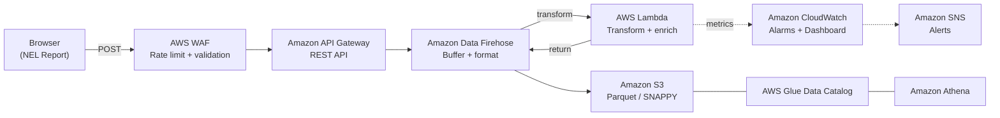

# NEL Reporting Pipeline

**Collect browser-reported network errors on AWS.** DNS resolution failures, TCP connection resets, and TLS handshake timeouts occur before requests reach your servers. The [W3C Network Error Logging](https://w3c.github.io/network-error-logging/) (NEL) specification enables supporting browsers to report these errors back to an endpoint you control. This project gives you a complete serverless pipeline to collect, store, and analyze those reports on AWS -- deployed in minutes with a single `cdk deploy`.

## Why NEL?

- **Catch failures your servers never see** -- DNS resolution errors, connection timeouts, and TLS failures happen before a request reaches your infrastructure
- **Real user data, not synthetic** -- every report comes from an actual browser session experiencing a real network path
- **Zero client-side code** -- browsers send reports automatically via HTTP headers, no JavaScript SDK needed
- **Measure error rates** by type, phase, URL, and server IP across real user sessions

> **Important:** This is sample code for demonstration and educational purposes only. It is not intended for production use without additional security review and testing. You should work with your security and legal teams to meet your organizational requirements before deployment. Deploying this solution may incur AWS charges.

## Architecture



| Layer | Service | Details |
|-------|---------|---------|
| Protection | AWS WAF | Positive security model: rate limit, AWS managed rules, path + method + body validation |
| Ingestion | API Gateway | Regional REST API, `application/reports+json` only |
| Buffering | Firehose | 64 MB / 300s buffer, Parquet format conversion (SNAPPY) |
| Transform | Lambda | Decode, validate, enrich. Publishes CloudWatch metrics |
| Storage | S3 | 14-day lifecycle, SSE-S3 encryption, Parquet columnar format |
| Analytics | Athena | Partition projection (year/month/day), no AWS Glue crawler needed |
| Alerting | CloudWatch + SNS | API errors, Lambda failures, Firehose issues, data freshness |

## Prerequisites

Before you begin, you need:

- Node.js 18.x or later
- AWS CDK CLI (`npm install -g aws-cdk`)
- AWS CLI configured with credentials (`aws configure`)
- An AWS account with permissions to create AWS CloudFormation stacks, Lambda functions, S3 buckets, API Gateway APIs, and related resources

## Quick Start

```bash
npm install
npm run build
cdk bootstrap aws://ACCOUNT-ID/REGION   # first time only
cdk deploy
```

The stack deploys to your configured AWS region (`CDK_DEFAULT_REGION` or AWS CLI profile).

Outputs after deploy:
- `APIEndpoint` -- your NEL reporting URL
- `BucketName` -- S3 bucket for reports
- `AlarmTopicArn` -- subscribe for alerts

Verify the deployment succeeded by confirming all three outputs are displayed. If the deployment fails, check the AWS CloudFormation console for error details.

Then [configure NEL headers](docs/nel-headers.md) on your web application or Amazon CloudFront distribution.

## Sending a Test Report

```bash
curl -X POST https://YOUR-API-ENDPOINT/prod/ \
  -H "Content-Type: application/reports+json" \
  -d '[{"type":"network-error","url":"https://example.com","body":{"type":"dns.name_not_resolved","phase":"dns","elapsed_time":5000,"sampling_fraction":1.0}}]'
```

## Querying Reports

```sql
SELECT body.type, COUNT(*) as cnt
FROM nel_analytics.nel_reports
WHERE year='2026' AND month='05' AND day='17'
GROUP BY body.type ORDER BY cnt DESC;
```

See [`docs/athena-queries.md`](docs/athena-queries.md) for more query patterns.

## Project Structure

```
bin/nel-project.ts           CDK app entry point (cdk-nag enabled)
lib/nel-project-stack.ts     CDK stack -- all infrastructure
lambda/index.js              Firehose transform: decode, validate, enrich
test/nel-project.test.ts     Unit tests (node:test, zero dependencies)
scripts/                     Deploy, cleanup, test, and load generation scripts
docs/                        Configuration, NEL headers, queries, monitoring
```

## Testing

```bash
npm test                                                        # unit tests
./scripts/test-nel-errors.sh https://YOUR-ENDPOINT/prod/ --all  # 30 NEL error types
./scripts/test-athena-queries.sh                                # 17 Athena queries
./scripts/generate-nel-data.sh https://YOUR-ENDPOINT/prod/ 5 10 # synthetic load
```

## Security

- AWS WAF positive security model: default BLOCK, label-based allow
- Rate limiting: 2000 req/min/IP + AWS IP Reputation + Core Rule Set + Known Bad Inputs
- Content-Type enforcement: only `application/reports+json` accepted
- S3: BlockPublicAccess, enforceSSL, SSE-S3 encryption
- AWS Identity and Access Management (IAM): least-privilege, namespace-scoped permissions
- No authentication by design -- browsers send NEL reports anonymously per W3C spec

## Cleanup

> **Warning:** Cleanup operations permanently delete all collected NEL report data. This action cannot be undone. Export any reports you need to retain before running cleanup scripts.

```bash
./scripts/cleanup.sh       # full teardown (stack + S3 + Data Catalog + logs)
cdk destroy                # stack only (S3 bucket retained by default)
```

## Documentation

- [Configuration](docs/configuration.md) -- feature toggles and options
- [NEL Headers](docs/nel-headers.md) -- how to enable NEL on your site
- [Athena Queries](docs/athena-queries.md) -- query cookbook
- [Monitoring](docs/monitoring.md) -- alarms, dashboard, Contributor Insights
- [API Schema](docs/api-schema.md) -- W3C NEL spec, WAF rules, API Gateway config

## Conclusion

This project provides a ready-to-deploy pipeline for collecting W3C Network Error Logging reports on AWS. Deploy it, configure NEL headers on your site, and start gaining visibility into network failures that your servers never see. Contributions and feedback are welcome through GitHub issues and pull requests. Review the [Security](#security) section and test thoroughly before using in production environments.

## Links

- [NEL Specification](https://w3c.github.io/network-error-logging/) | [Reporting API](https://w3c.github.io/reporting/)
- [AWS CDK](https://docs.aws.amazon.com/cdk/) | [Firehose](https://docs.aws.amazon.com/firehose/) | [Amazon Athena](https://docs.aws.amazon.com/athena/)

## License

This library is licensed under the MIT-0 License. See the [LICENSE](LICENSE) file.
